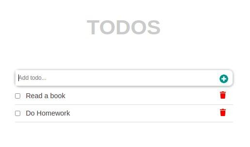

# UserList app built usig React !

Single page app that adds a list of toDo tasks. Users can edit and delete tasks.

## Built With

- React
- Java Script
- HTML
- CSS

## Website Demo

[Demo-page](http://ShoiraTa.github.io/react-todo)

## Authors

👤 **Shoira Toshpulatova**

- GitHub: [@githubhandle](https://github.com/shoirata)
- LinkedIn: [LinkedIn](https://www.linkedin.com/in/shoira-tashpulatova-bab4a7122/)

## Acknowledgments

- Microverse

## 📝 License

This project is [MIT](./MIT) licensed.
